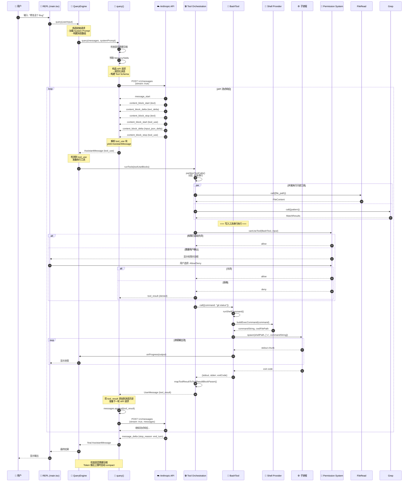

# Claude Code Agent Loop 与 Tool Use 机制深度解析

> **目标读者**: 新入职的核心开发工程师
> **文档版本**: 1.0
> **生成时间**: 2026-04-09

---

## 目录

1. [System Prompt 构造机制](#1-system-prompt-构造机制)
2. [Tool Calling 完整流程](#2-tool-calling-完整流程)
3. [权限询问 (Approval) 机制](#3-权限询问-approval-机制)
4. [上下文裁剪与压缩](#4-上下文裁剪与压缩)
5. [完整交互时序图](#5-完整交互时序图)

---

## 1. System Prompt 构造机制

### 1.1 核心入口函数

**位置**: `src/constants/prompts.ts` 第444行

```typescript
export async function getSystemPrompt(
  tools: Tools,
  model: string,
  additionalWorkingDirectories?: string[],
  mcpClients?: MCPServerConnection[],
): Promise<string[]> {
  // 简单模式（调试用）
  if (isEnvTruthy(process.env.CLAUDE_CODE_SIMPLE)) {
    return [
      `You are Claude Code, Anthropic's official CLI for Claude.\n\nCWD: ${getCwd()}\nDate: ${getSessionStartDate()}`,
    ]
  }
  // ... 完整构造逻辑
}
```

### 1.2 System Prompt 前缀定义

**位置**: `src/constants/system.ts` 第10-46行

```typescript
const DEFAULT_PREFIX = `You are Claude Code, Anthropic's official CLI for Claude.`
const AGENT_SDK_CLAUDE_CODE_PRESET_PREFIX = `You are Claude Code, Anthropic's official CLI for Claude, running within the Claude Agent SDK.`
const AGENT_SDK_PREFIX = `You are a Claude agent, built on Anthropic's Claude Agent SDK.`

export function getCLISyspromptPrefix(options?: {
  isNonInteractive: boolean
  hasAppendSystemPrompt: boolean
}): CLISyspromptPrefix {
  const apiProvider = getAPIProvider()
  if (apiProvider === 'vertex') {
    return DEFAULT_PREFIX
  }

  if (options?.isNonInteractive) {
    if (options.hasAppendSystemPrompt) {
      return AGENT_SDK_CLAUDE_CODE_PRESET_PREFIX
    }
    return AGENT_SDK_PREFIX
  }
  return DEFAULT_PREFIX
}
```

### 1.3 动态内容注入

System Prompt 采用**分段构造**策略，分为**静态缓存区**和**动态注入区**：

**位置**: `src/constants/prompts.ts` 第560-576行

```typescript
return [
  // --- Static content (cacheable) ---
  getSimpleIntroSection(outputStyleConfig),
  getSimpleSystemSection(),
  getSimpleDoingTasksSection(),
  getActionsSection(),
  getUsingYourToolsSection(enabledTools),
  getSimpleToneAndStyleSection(),
  getOutputEfficiencySection(),
  // === BOUNDARY MARKER - DO NOT MOVE OR REMOVE ===
  ...(shouldUseGlobalCacheScope() ? [SYSTEM_PROMPT_DYNAMIC_BOUNDARY] : []),
  // --- Dynamic content (registry-managed) ---
  ...resolvedDynamicSections,
].filter(s => s !== null)
```

**关键边界标记**: `__SYSTEM_PROMPT_DYNAMIC_BOUNDARY__`
- 边界之前的内容可以全局缓存
- 边界之后的内容包含用户/会话特定信息，不能缓存

### 1.4 动态 Section 来源

**位置**: `src/constants/prompts.ts` 第491-555行

```typescript
const dynamicSections = [
  systemPromptSection('session_guidance', () =>
    getSessionSpecificGuidanceSection(enabledTools, skillToolCommands),
  ),
  systemPromptSection('memory', () => loadMemoryPrompt()),
  systemPromptSection('ant_model_override', () =>
    getAntModelOverrideSection(),
  ),
  systemPromptSection('env_info_simple', () =>
    computeSimpleEnvInfo(model, additionalWorkingDirectories),
  ),
  systemPromptSection('language', () =>
    getLanguageSection(settings.language),
  ),
  systemPromptSection('output_style', () =>
    getOutputStyleSection(outputStyleConfig),
  ),
  DANGEROUS_uncachedSystemPromptSection(
    'mcp_instructions',
    () => isMcpInstructionsDeltaEnabled()
      ? null
      : getMcpInstructionsSection(mcpClients),
    'MCP servers connect/disconnect between turns',
  ),
  // ... 更多动态 sections
]
```

### 1.5 系统提示拼接函数

**位置**: `src/services/api/claude.ts` 第1358-1372行

```typescript
systemPrompt = asSystemPrompt(
  [
    getAttributionHeader(fingerprint),
    getCLISyspromptPrefix({
      isNonInteractive: options.isNonInteractiveSession,
      hasAppendSystemPrompt: options.hasAppendSystemPrompt,
    }),
    ...systemPrompt,
    ...(advisorModel ? [ADVISOR_TOOL_INSTRUCTIONS] : []),
    ...(injectChromeHere ? [CHROME_TOOL_SEARCH_INSTRUCTIONS] : []),
  ].filter(Boolean),
)

// Prepend system prompt block for easy API identification
logAPIPrefix(systemPrompt)
```

---

## 2. Tool Calling 完整流程

### 2.1 API 响应流处理 (tool_use 解析)

**位置**: `src/services/api/claude.ts` 第1979-2052行

```typescript
for await (const part of stream) {
  switch (part.type) {
    case 'content_block_start':
      switch (part.content_block.type) {
        case 'tool_use':
          // 初始化 tool_use 块
          contentBlocks[part.index] = {
            ...part.content_block,
            input: '',  // input_json 会通过 delta 累积
          }
          break
        // ...
      }
      break

    case 'content_block_delta':
      switch (delta.type) {
        case 'input_json_delta':
          // 累积 tool input JSON
          contentBlock.input += delta.partial_json
          break
      }
      break

    case 'content_block_stop':
      // tool_use 块完成，创建 AssistantMessage
      const m: AssistantMessage = {
        message: {
          ...partialMessage,
          content: normalizeContentFromAPI(
            [contentBlock] as BetaContentBlock[],
            tools,
            options.agentId,
          ),
        },
        requestId: streamRequestId ?? undefined,
        type: 'assistant',
        uuid: randomUUID(),
        timestamp: new Date().toISOString(),
      }
      newMessages.push(m)
      yield m
      break
  }
}
```

### 2.2 Tool 调度入口

**位置**: `src/query.ts` - `query()` 函数的主循环

API 返回 tool_use 块后，代码会：
1. 解析 tool_use 块
2. 通过 `runTools()` 执行工具
3. 将结果封装为 `tool_result` 消息
4. 发送回 API 继续对话

### 2.3 Tool 编排器

**位置**: `src/services/tools/toolOrchestration.ts` 第19-82行

```typescript
export async function* runTools(
  toolUseMessages: ToolUseBlock[],
  assistantMessages: AssistantMessage[],
  canUseTool: CanUseToolFn,
  toolUseContext: ToolUseContext,
): AsyncGenerator<MessageUpdate, void> {
  let currentContext = toolUseContext

  // 将工具调用分区为批次
  for (const { isConcurrencySafe, blocks } of partitionToolCalls(
    toolUseMessages,
    currentContext,
  )) {
    if (isConcurrencySafe) {
      // 并发执行只读工具（如 FileRead、Grep）
      for await (const update of runToolsConcurrently(
        blocks,
        assistantMessages,
        canUseTool,
        currentContext,
      )) {
        yield update
      }
    } else {
      // 串行执行写入工具（如 FileEdit、Bash）
      for await (const update of runToolsSerially(
        blocks,
        assistantMessages,
        canUseTool,
        currentContext,
      )) {
        yield update
      }
    }
  }
}
```

### 2.4 BashTool 完整执行流程

#### 2.4.1 BashTool 定义

**位置**: `src/tools/BashTool/BashTool.tsx` 第420-500行

```typescript
export const BashTool = buildTool({
  name: BASH_TOOL_NAME,  // 'Bash'
  searchHint: 'execute shell commands',
  maxResultSizeChars: 30_000,
  strict: true,

  // 输入 Schema
  get inputSchema(): InputSchema {
    return inputSchema()
  },

  // 输出 Schema
  get outputSchema(): OutputSchema {
    return outputSchema()
  },

  // 权限检查
  async checkPermissions(input, context): Promise<PermissionResult> {
    return bashToolHasPermission(input, context)
  },

  // 核心调用逻辑
  async call(input: BashToolInput, toolUseContext, _canUseTool?, parentMessage?, onProgress?) {
    // ... 实现细节见下文
  }
})
```

#### 2.4.2 BashTool.call() 核心实现

**位置**: `src/tools/BashTool/BashTool.tsx` 第624-824行

```typescript
async call(input: BashToolInput, toolUseContext, _canUseTool?, parentMessage?, onProgress?) {
  // 处理模拟的 sed 编辑（权限预览后的直接应用）
  if (input._simulatedSedEdit) {
    return applySedEdit(input._simulatedSedEdit, toolUseContext, parentMessage)
  }

  const { abortController, getAppState, setAppState, setToolJSX } = toolUseContext
  const stdoutAccumulator = new EndTruncatingAccumulator()

  try {
    // 使用异步生成器版本的 shell 命令执行
    const commandGenerator = runShellCommand({
      input,
      abortController,
      setAppState: toolUseContext.setAppStateForTasks ?? setAppState,
      setToolJSX,
      preventCwdChanges,
      isMainThread,
      toolUseId: toolUseContext.toolUseId,
      agentId: toolUseContext.agentId
    })

    // 消费生成器并捕获进度
    let generatorResult
    do {
      generatorResult = await commandGenerator.next()
      if (!generatorResult.done && onProgress) {
        const progress = generatorResult.value
        onProgress({
          toolUseID: `bash-progress-${progressCounter++}`,
          data: {
            type: 'bash_progress',
            output: progress.output,
            fullOutput: progress.fullOutput,
            elapsedTimeSeconds: progress.elapsedTimeSeconds,
            totalLines: progress.totalLines,
            totalBytes: progress.totalBytes,
            taskId: progress.taskId,
            timeoutMs: progress.timeoutMs
          }
        })
      }
    } while (!generatorResult.done)

    // 获取最终结果
    result = generatorResult.value

    // 累积输出
    stdoutAccumulator.append((result.stdout || '').trimEnd() + EOL)

    // 解释命令结果（语义分析）
    interpretationResult = interpretCommandResult(
      input.command,
      result.code,
      result.stdout || '',
      ''
    )
  } finally {
    if (setToolJSX) setToolJSX(null)
  }

  // 处理大输出：持久化到磁盘
  let persistedOutputPath: string | undefined
  let persistedOutputSize: number | undefined
  if (result.outputFilePath && result.outputTaskId) {
    const fileStat = await fsStat(result.outputFilePath)
    persistedOutputSize = fileStat.size
    await ensureToolResultsDir()
    const dest = getToolResultPath(result.outputTaskId, false)
    // 复制输出文件到 tool-results 目录
    await link(result.outputFilePath, dest).catch(() =>
      copyFile(result.outputFilePath, dest)
    )
    persistedOutputPath = dest
  }

  // 返回结果
  return {
    stdout: strippedStdout,
    stderr: '',
    interrupted: wasInterrupted,
    isImage,
    backgroundTaskId,
    backgroundedByUser,
    assistantAutoBackgrounded,
    persistedOutputPath,
    persistedOutputSize,
    noOutputExpected: isSilentBashCommand(input.command),
  }
}
```

#### 2.4.3 Shell 命令执行

**位置**: `src/utils/shell/bashProvider.ts` 第58-150行

```typescript
export async function createBashShellProvider(
  shellPath: string,
  options?: { skipSnapshot?: boolean },
): Promise<ShellProvider> {
  return {
    type: 'bash',
    shellPath,
    detached: true,

    async buildExecCommand(command: string, opts): Promise<{
      commandString: string
      cwdFilePath: string
    }> {
      // 创建临时 CWD 文件
      const tmpdir = osTmpdir()
      const shellTmpdir = isWindows
        ? windowsPathToPosixPath(tmpdir)
        : tmpdir

      const shellCwdFilePath = opts.useSandbox
        ? posixJoin(opts.sandboxTmpDir!, `cwd-${opts.id}`)
        : posixJoin(shellTmpdir, `claude-${opts.id}-cwd`)
      const cwdFilePath = opts.useSandbox
        ? posixJoin(opts.sandboxTmpDir!, `cwd-${opts.id}`)
        : nativeJoin(tmpdir, `claude-${opts.id}-cwd`)

      // 规范化命令（处理 Windows 特殊重定向）
      const normalizedCommand = rewriteWindowsNullRedirect(command)
      const addStdinRedirect = shouldAddStdinRedirect(normalizedCommand)
      let quotedCommand = quoteShellCommand(normalizedCommand, addStdinRedirect)

      // 特殊处理管道命令
      if (containsPipe(normalizedCommand)) {
        quotedCommand = rearrangePipeCommand(quotedCommand, addStdinRedirect)
      }

      // 构建完整命令字符串
      const commandString = formatShellPrefixCommand(
        shellPath,
        quotedCommand,
        snapshotFilePath,
        shellCwdFilePath,
        opts.useSandbox,
        currentSandboxTmpDir,
      )

      return { commandString, cwdFilePath }
    }
  }
}
```

#### 2.4.4 子进程 Spawning

**位置**: `src/utils/shell/execProvider.ts` (推断)

实际的子进程创建使用 `execa` 或类似库：

```typescript
// 伪代码，展示核心逻辑
const { spawn } = require('child_process')

const childProcess = spawn(shellPath, ['-c', commandString], {
  cwd: cwdFilePath,
  env: { ...process.env, ...customEnvVars },
  stdio: ['ignore', 'pipe', 'pipe'],  // stdin=ignore, stdout=pipe, stderr=merge
  detached: true,
})

// 捕获输出
childProcess.stdout.on('data', (chunk) => {
  stdoutAccumulator.append(chunk.toString())
})
```

### 2.5 Tool Result 封装

**位置**: `src/tools/BashTool/BashTool.tsx` 第555-623行

```typescript
mapToolResultToToolResultBlockParam({
  interrupted,
  stdout,
  stderr,
  isImage,
  backgroundTaskId,
  backgroundedByUser,
  assistantAutoBackgrounded,
  structuredContent,
  persistedOutputPath,
  persistedOutputSize,
}, toolUseID): ToolResultBlockParam {
  // 处理结构化内容
  if (structuredContent && structuredContent.length > 0) {
    return {
      tool_use_id: toolUseID,
      type: 'tool_result',
      content: structuredContent,
    }
  }

  // 处理大输出（持久化到磁盘）
  if (persistedOutputPath) {
    const preview = generatePreview(processedStdout, PREVIEW_SIZE_BYTES)
    processedStdout = buildLargeToolResultMessage({
      filepath: persistedOutputPath,
      originalSize: persistedOutputSize ?? 0,
      isJson: false,
      preview: preview.preview,
      hasMore: preview.hasMore
    })
  }

  // 返回 tool_result 块
  return {
    tool_use_id: toolUseID,
    type: 'tool_result',
    content: [processedStdout, errorMessage, backgroundInfo]
      .filter(Boolean)
      .join('\n'),
    is_error: interrupted,
  }
}
```

---

## 3. 权限询问 (Approval) 机制

### 3.1 权限检查入口

**位置**: `src/hooks/useCanUseTool.tsx` 第28-60行

```typescript
function useCanUseTool(setToolUseConfirmQueue, setToolPermissionContext) {
  return async (tool, input, toolUseContext, assistantMessage, toolUseID, forceDecision) => {
    const ctx = createPermissionContext(
      tool,
      input,
      toolUseContext,
      assistantMessage,
      toolUseID,
      setToolPermissionContext,
      createPermissionQueueOps(setToolUseConfirmQueue)
    )

    // 检查是否中断
    if (ctx.resolveIfAborted(resolve)) return

    // 核心权限决策
    const decisionPromise = forceDecision !== undefined
      ? Promise.resolve(forceDecision)
      : hasPermissionsToUseTool(tool, input, toolUseContext, assistantMessage, toolUseID)

    return decisionPromise.then(async result => {
      if (result.behavior === "allow") {
        // 允许执行
        if (feature("TRANSCRIPT_CLASSIFIER") &&
            result.decisionReason?.type === "classifier" &&
            result.decisionReason.classifier === "auto-mode") {
          setYoloClassifierApproval(toolUseID, result.decisionReason.reason)
        }
        ctx.logDecision({ decision: "accept", source: "config" })
        resolve(ctx.buildAllow(result.updatedInput ?? input, {
          decisionReason: result.decisionReason
        }))
        return
      }

      // 处理拒绝
      if (result.behavior === "deny") {
        logPermissionDecision({ tool, input, toolUseContext, messageId: ctx.messageId, toolUseID }, {
          decision: "reject",
          source: "config"
        })
        if (feature("TRANSCRIPT_CLASSIFIER") &&
            result.decisionReason?.type === "classifier" &&
            result.decisionReason.classifier === "auto-mode") {
          // 记录自动模式拒绝
          recordAutoModeDenial({
            toolName: tool.name,
            display: description,
            reason: result.decisionReason.reason ?? "",
            timestamp: Date.now()
          })
        }
        resolve(result)
        return
      }

      // 需要询问用户
      if (result.behavior === "ask") {
        // ... 交互式权限处理
      }
    })
  }
}
```

### 3.2 交互式权限处理

**位置**: `src/hooks/toolPermission/handlers/interactiveHandler.ts`

权限询问发生在以下情况：
1. 用户设置了需要权限确认的模式
2. 工具不在自动允许列表中
3. 命令匹配安全规则需要确认

### 3.3 自动模式 (Auto Mode) 分类器

**位置**: `src/tools/BashTool/bashPermissions.ts`

```typescript
// 自动模式的命令分类
export async function awaitClassifierAutoApproval(
  command: string,
  toolUseID: string
): Promise<ClassifierDecision | null> {
  // 使用机器学习模型分析命令安全性
  // 返回 { matches: boolean, confidence: 'high' | 'low', matchedDescription?: string }
}
```

### 3.4 权限模式类型

**位置**: `src/utils/permissions/PermissionMode.ts`

```typescript
export enum PermissionMode {
  // 默认模式：每次工具调用都需要用户确认
  'default' = 'default',

  // 自动模式：使用分类器自动决定是否允许
  'auto' = 'auto',

  // 计划模式：在计划阶段需要确认，执行时自动允许
  'plan' = 'plan',
}
```

---

## 4. 上下文裁剪与压缩

### 4.1 压缩触发条件

**位置**: `src/query.ts` 第340-400行

```typescript
while (true) {
  // 检查是否需要压缩
  const { shouldCompact, compactReason } = await shouldTriggerAutoCompact({
    messages: state.messages,
    autoCompactTracking,
    config,
  })

  if (shouldCompact) {
    // 执行压缩
    const compactResult = await compactConversation({
      messages: state.messages,
      systemPrompt,
      querySource,
      agentId: toolUseContext.agentId,
    })

    // 更新消息历史
    state = {
      ...state,
      messages: compactResult.messages,
      autoCompactTracking: compactResult.tracking,
    }
  }

  // ... 继续查询循环
}
```

### 4.2 自动压缩检测

**位置**: `src/services/compact/autoCompact.ts`

```typescript
export async function shouldTriggerAutoCompact(
  params: AutoCompactParams
): Promise<{ shouldCompact: boolean; compactReason?: string }> {
  // 计算 Token 估算
  const tokenCount = await tokenCountWithEstimation(params.messages)

  // 检查是否超过阈值
  if (tokenCount > COMPACT_THRESHOLD) {
    return {
      shouldCompact: true,
      compactReason: `Token count ${tokenCount} exceeds threshold ${COMPACT_THRESHOLD}`
    }
  }

  return { shouldCompact: false }
}
```

### 4.3 压缩实现

**位置**: `src/services/compact/compact.ts` 第387行+

```typescript
export async function compactConversation(params: CompactParams): Promise<{
  messages: Message[]
  tracking: AutoCompactTrackingState
}> {
  // 1. 移除图片（不需要用于摘要）
  const messagesWithoutImages = stripImagesFromMessages(params.messages)

  // 2. 按 API 轮次分组消息
  const grouped = groupMessagesByApiRound(messagesWithoutImages)

  // 3. 构建压缩提示
  const compactPrompt = getCompactPrompt(grouped, params.systemPrompt)

  // 4. 调用 API 生成摘要
  const compactResult = await queryModelWithStreaming({
    model: params.fallbackModel || getSmallFastModel(),
    messages: [
      { role: 'user', content: compactPrompt }
    ],
    maxTokens: COMPACT_MAX_OUTPUT_TOKENS,
  })

  // 5. 解析摘要并构建新消息历史
  const compactBoundary = createCompactBoundaryMessage(compactResult)
  const messagesAfterBoundary = getMessagesAfterCompactBoundary(params.messages)

  // 6. 重新注入关键上下文（文件列表、Git 状态等）
  const restoredMessages = await restorePostCompactContext({
    boundaryMessage: compactBoundary,
    messagesAfterBoundary,
    budget: POST_COMPACT_TOKEN_BUDGET,
  })

  return {
    messages: [compactBoundary, ...restoredMessages],
    tracking: { lastCompactAt: Date.now(), compactCount: tracking.compactCount + 1 }
  }
}
```

### 4.4 微压缩 (Microcompact)

**位置**: `src/services/compact/microCompact.ts`

```typescript
export async function microcompactMessages(
  params: MicrocompactParams
): Promise<Message[]> {
  // 使用服务器端的缓存编辑功能
  // 将工具结果替换为占位符，减少 Token 使用

  const cacheEdits = params.messages.flatMap(msg => {
    if (msg.type === 'user' && isToolResultMessage(msg)) {
      // 大工具结果转换为缓存编辑引用
      return [{
        cache_edit: {
          cache_control: { type: 'ephemeral' },
          tool_result_id: extractToolResultId(msg),
          placeholder: generatePlaceholder(msg),
        }
      }]
    }
    return []
  })

  // 将缓存编辑注入到消息中
  return injectCacheEdits(params.messages, cacheEdits)
}
```

### 4.5 Token 上限保护

**位置**: `src/utils/context.ts`

```typescript
// 上下文窗口限制常量
export const CAPPED_DEFAULT_MAX_TOKENS = 8192

export function getMaxOutputTokensForModel(model: string): number {
  // 根据模型返回不同的输出 Token 上限
  if (model.includes('opus')) {
    return 8192
  } else if (model.includes('sonnet')) {
    return 8192
  } else if (model.includes('haiku')) {
    return 4096
  }
  return CAPPED_DEFAULT_MAX_TOKENS
}

// 检查是否超过 200k 上下文
export function doesMostRecentAssistantMessageExceed200k(
  messages: Message[]
): boolean {
  const lastAssistant = getLastAssistantMessage(messages)
  if (!lastAssistant) return false

  const tokens = tokenCountFromLastAPIResponse(lastAssistant)
  return tokens > 200_000
}
```

---

## 5. 完整交互时序图



---

## 6. 关键代码位置索引

| 功能模块 | 文件路径 | 关键函数/行号 |
|---------|---------|--------------|
| **System Prompt** | | |
| Prompt 入口 | `src/constants/prompts.ts` | `getSystemPrompt()` :444 |
| 动态边界标记 | `src/constants/prompts.ts` | `SYSTEM_PROMPT_DYNAMIC_BOUNDARY` :114 |
| 前缀定义 | `src/constants/system.ts` | `getCLISyspromptPrefix()` :30 |
| Prompt 拼接 | `src/services/api/claude.ts` | `asSystemPrompt()` :1358 |
| **Tool Calling** | | |
| API 响应解析 | `src/services/api/claude.ts` | 流处理循环 :1940 |
| Tool 编排 | `src/services/tools/toolOrchestration.ts` | `runTools()` :19 |
| BashTool 定义 | `src/tools/BashTool/BashTool.tsx` | `BashTool = buildTool()` :420 |
| BashTool.call() | `src/tools/BashTool/BashTool.tsx` | `call()` :624 |
| Shell 命令构建 | `src/utils/shell/bashProvider.ts` | `createBashShellProvider()` :58 |
| **权限系统** | | |
| 权限检查入口 | `src/hooks/useCanUseTool.tsx` | `useCanUseTool()` :28 |
| 交互式处理 | `src/hooks/toolPermission/handlers/interactiveHandler.ts` | - |
| Auto Mode 分类 | `src/tools/BashTool/bashPermissions.ts` | `awaitClassifierAutoApproval()` |
| **上下文压缩** | | |
| 自动压缩检测 | `src/services/compact/autoCompact.ts` | `shouldTriggerAutoCompact()` |
| 压缩实现 | `src/services/compact/compact.ts` | `compactConversation()` :387 |
| 微压缩 | `src/services/compact/microCompact.ts` | `microcompactMessages()` :253 |
| Token 限制 | `src/utils/context.ts` | `getMaxOutputTokensForModel()` |
| **查询循环** | | |
| Query 入口 | `src/query.ts` | `query()` :219 |
| 主循环 | `src/query.ts` | `queryLoop()` :241 |
| QueryEngine | `src/QueryEngine.ts` | `query()` 函数 |

---

## 7. 架构设计要点

### 7.1 异步生成器模式

整个 Tool Calling 流程使用 TypeScript 异步生成器 (`AsyncGenerator`) 实现：

```typescript
export async function* query(...): AsyncGenerator<StreamEvent | Message, Terminal> {
  while (true) {
    // 1. 发送 API 请求
    for await (const part of stream) {
      if (part.type === 'content_block_stop') {
        yield assistantMessage  // 实时返回给 UI
      }
    }

    // 2. 执行工具
    for await (const update of runTools(...)) {
      yield update.message  // 实时返回工具结果
    }

    // 3. 决定是否继续
    if (shouldStop) break
  }
}
```

### 7.2 缓存策略

- **全局缓存边界**: `__SYSTEM_PROMPT_DYNAMIC_BOUNDARY__` 之前的内容可跨会话缓存
- **缓存编辑 (Cache Edits)**: 大工具结果替换为占位符，减少 Token 使用
- **Prompt Cache Break Detection**: 检测缓存破坏点，自动重启缓存链

### 7.3 并发控制

- **只读工具并发执行**: `FileRead`, `Grep` 等可以同时运行
- **写入工具串行执行**: `FileEdit`, `Bash` 等按顺序执行
- **分区逻辑**: `partitionToolCalls()` 根据工具类型自动分区

### 7.4 错误恢复

- **最大输出 Token 恢复**: 当触发 `max_output_tokens` 错误时，自动调整 `max_tokens` 重试
- **非流式降级**: 流式请求失败时，自动降级到非流式请求
- **压缩触发**: Token 接近上限时，自动触发压缩

---

*本文档由静态代码分析生成，包含核心代码片段和行号引用。建议结合实际源代码阅读。*
