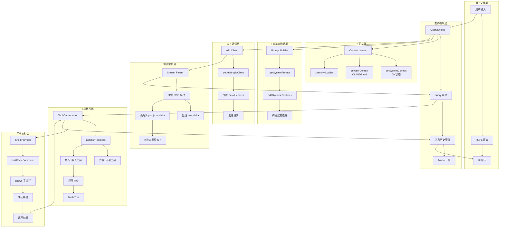
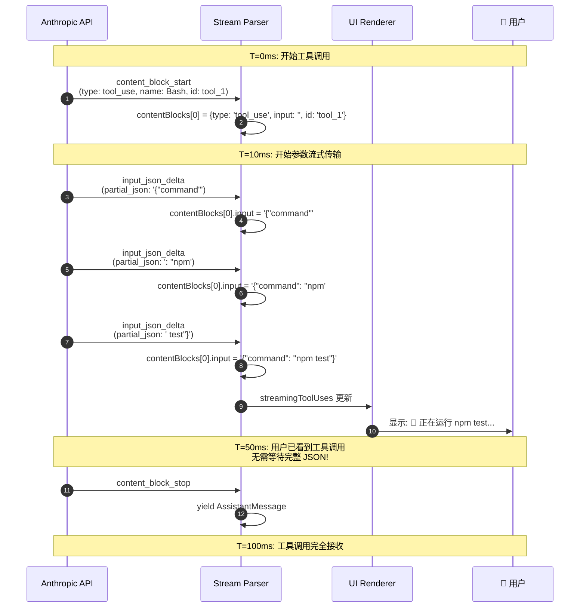
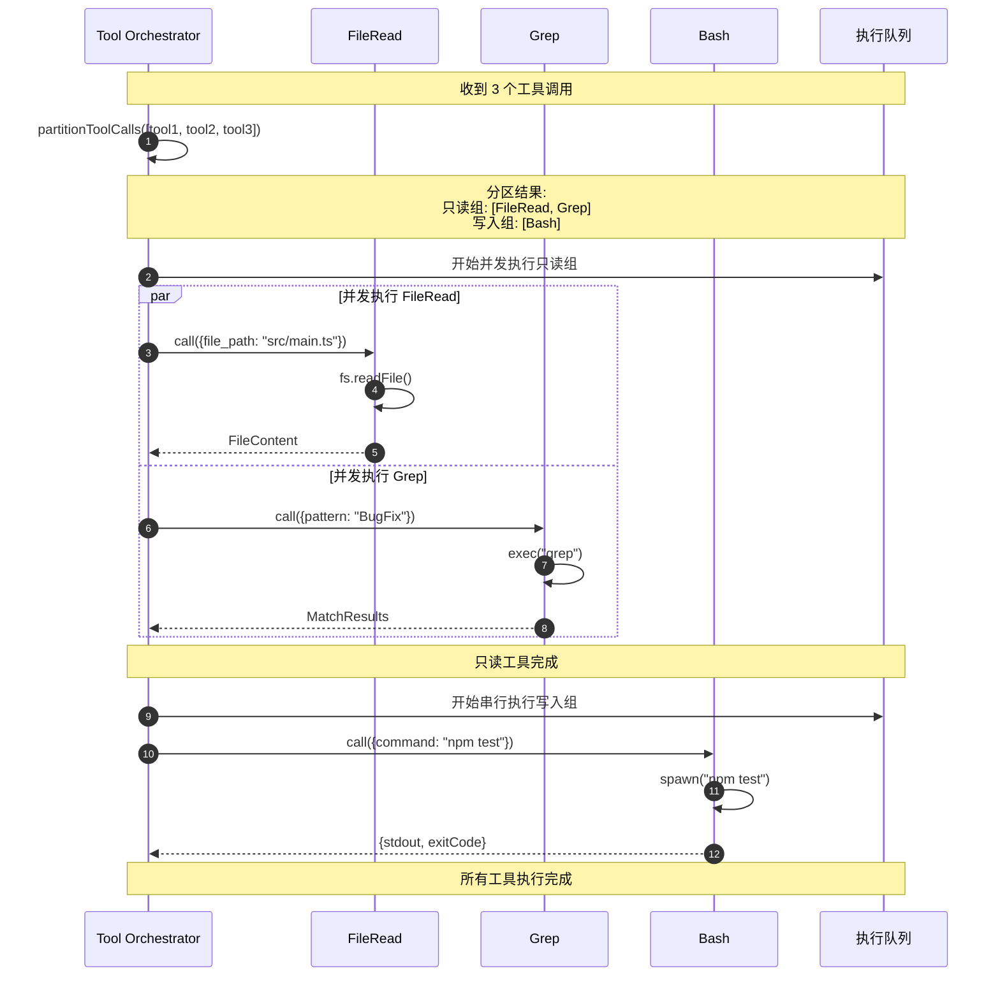
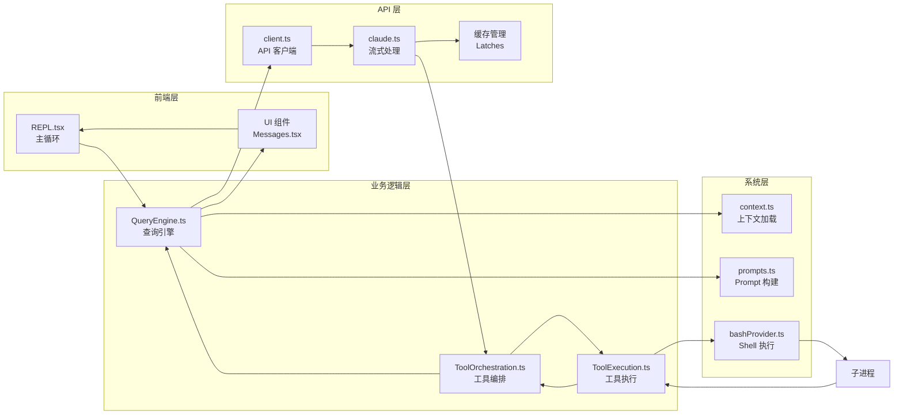

# Claude Code 完整交互链路时序图

> **文档类型**: 交互流程可视化
> **生成时间**: 2026-04-09

---

## 1. 完整时序图 (Sequence Diagram)

从用户输入 `"修复这个 Bug"` 到最终输出的完整交互链路：

```mermaid
sequenceDiagram
    autonumber
    actor User as 👤 用户
    participant REPL as 🔄 REPL.tsx
    participant QueryEngine as 🧠 QueryEngine
    participant Query as 📡 query()
    participant Context as 📚 Context Loader
    participant PromptBuilder as 📝 Prompt Builder
    participant API as ☁️ Anthropic API
    participant StreamParser as 🔍 Stream Parser
    participant ToolOrch as 🛠️ Tool Orchestrator
    participant Permission as 🔐 Permission System
    participant BashTool as 🔧 BashTool
    participant Shell as 🐚 Shell Provider
    participant Process as ⚙️ 子进程
    participant UI as 🖥️ UI Renderer

    Note over User,UI: === 阶段 1: 用户输入与初始化 ===

    User->>REPL: 输入: "修复这个 Bug"
    REPL->>QueryEngine: query(userInput)
    
    QueryEngine->>Context: getUserContext()
    Context->>Context: getGitStatus() [并发]
    Context->>Context: getClaudeMds() [并发]
    Context-->>QueryEngine: { gitStatus, claudeMd, currentDate }
    
    QueryEngine->>PromptBuilder: getSystemPrompt(tools, model)
    PromptBuilder-->>QueryEngine: systemPrompt[]

    Note over User,UI: === 阶段 2: 构造 API 请求 ===

    QueryEngine->>Query: query(messages, systemPrompt)
    Query->>Query: 检查是否需要压缩
    Query->>Query: 预取 Memory/Skills
    
    Query->>API: POST /v1/messages (stream: true)
    Note over Query,API: 包含:<br/>- system: [...]<br/>- messages: [...]<br/>- tools: [...]<br/>- betas: ["advanced-tool-use-2025-11-20", ...]

    Note over User,UI: === 阶段 3: API 流式响应 ===

    loop API 流式循环
        API-->>StreamParser: SSE Event
        StreamParser->>StreamParser: 解析事件类型

        alt 事件类型: text_delta
            API-->>StreamParser: content_block_delta (text)
            StreamParser->>StreamParser: 累积文本内容
            StreamParser-->>Query: AssistantMessage (text 流)
            Query-->>UI: 实时显示文本输出
        and 事件类型: content_block_start (tool_use)
            API-->>StreamParser: content_block_start (tool_use)
            StreamParser->>StreamParser: 初始化 tool_use 块
            StreamParser-->>Query: AssistantMessage (tool_use)
        and 事件类型: input_json_delta
            API-->>StreamParser: content_block_delta (input_json_delta)
            Note over StreamParser: 关键优化: 字符串累积 O(n)<br/>而非 JSON.parse O(n²)
            StreamParser->>StreamParser: contentBlock.input += delta.partial_json
            StreamParser-->>Query: 更新 tool_use 显示
            Query-->>UI: 显示工具调用参数 (实时更新)
        and 事件类型: content_block_stop
            API-->>StreamParser: content_block_stop
            StreamParser-->>Query: 完整 AssistantMessage
        end

        API-->>StreamParser: message_delta (usage, stop_reason)
        StreamParser-->>Query: 更新 usage 统计
    end

    Note over User,UI: === 阶段 4: 工具执行 ===

    Query->>ToolOrch: runTools(toolUseBlocks)
    
    par 并发执行只读工具
        ToolOrch->>FileRead: call({file_path})
        FileRead-->>ToolOrch: 文件内容
        and
        ToolOrch->>Grep: call({pattern})
        Grep-->>ToolOrch: 匹配结果
    end
    
    Note over ToolOrch,BashTool: === 串行执行写入工具 ===

    ToolOrch->>Permission: canUseTool(BashTool, input)
    
    alt 权限自动允许
        Permission-->>ToolOrch: allow
    else 需要用户确认
        Permission-->>UI: 显示权限对话框
        User->>Permission: 点击 Allow
        Permission-->>ToolOrch: allow
    end

    ToolOrch->>BashTool: call({command: "npm test"})
    
    Note over BashTool,Shell: === 命令执行流程 ===

    BashTool->>BashTool: runShellCommand()
    BashTool->>Shell: buildExecCommand(command)
    Shell-->>BashTool: commandString, cwdFilePath
    
    BashTool->>Process: spawn(shellPath, ['-c', commandString])
    
    loop 进程输出流
        Process-->>BashTool: stdout chunk
        BashTool->>BashTool: 累积输出
        BashTool->>QueryEngine: onProgress(output)
        QueryEngine-->>UI: 显示进度 (实时)
    end
    
    Process-->>BashTool: exit code
    BashTool-->>ToolOrch: {stdout, stderr, exitCode}
    
    ToolOrch->>ToolOrch: mapToolResultToToolResultBlockParam()
    ToolOrch-->>Query: UserMessage (tool_result)

    Note over User,UI: === 阶段 5: 结果返回与下一轮 ===

    Query->>Query: messages.append(tool_result)
    
    alt API 还有更多内容
        Query->>API: 继续处理流式响应
        API-->>Query: 更多 AssistantMessage
    else 完成
        Query-->>QueryEngine: 最终结果
    end

    QueryEngine-->>REPL: final AssistantMessage
    REPL-->>User: 显示最终输出
```

---

## 2. 组件职责泳道图 (Swimlane Diagram)



---

## 3. 核心流程详细时序 (关键步骤放大)

### 3.1 工具调用实时渲染流程



### 3.2 并发工具执行流程



### 3.3 权限检查介入点

```mermaid
sequenceDiagram
    autonumber
    participant Tool as Tool Orchestrator
    participant Perm as Permission System
    participant Dialog as 权限对话框
    participant User as 👤 用户

    Tool->>Perm: canUseTool(BashTool, {command: "rm -rf /"})
    
    Perm->>Perm: 检查配置的权限模式
    
    alt 模式: default (默认确认)
        Perm->>Dialog: 显示确认对话框
        Note over Dialog,User: 对话框内容:<br/>⚠️ 危险操作: rm -rf<br/>📍 将删除: /<br/>确认执行?
        Dialog->>User: 显示对话框
        User->>Dialog: 点击 [Allow]
        Dialog-->>Perm: allow
    and 模式: auto (自动模式)
        Perm->>Perm: 运行分类器
        alt 分类器: 高置信度 + 安全命令
            Perm-->>Tool: allow
        else 分类器: 低置信度或危险命令
            Perm->>Dialog: 显示确认对话框
            User->>Dialog: 用户选择
            Dialog-->>Perm: allow/deny
        end
    else 模式: plan (计划模式)
        Perm-->>Tool: allow (计划阶段已确认)
    end
    
    Perm-->>Tool: PermissionResult
```

---

## 4. 数据流图 (Data Flow)

```mermaid
flowchart LR
    Start([用户输入:<br/>"修复这个 Bug"]) --> Init[初始化<br/>QueryEngine]
    
    Init --> LoadCtx[加载上下文]
    LoadCtx --> |gitStatus| BuildGit[Git 状态]
    LoadCtx --> |claudeMd| BuildDocs[CLAUDE.md]
    
    BuildGit --> BuildSys[构建 System Prompt]
    BuildDocs --> BuildSys
    
    BuildSys --> Cache{启用缓存:<br/>cache_control}
    
    Cache --> API[发送 API 请求]
    
    API --> Stream[流式响应]
    
    Stream --> |text_delta| TextMsg[文本消息]
    Stream --> |tool_use| ToolMsg[工具消息]
    
    ToolMsg --> ParseJSON[解析工具参数<br/>input_json_delta 累积]
    
    ParseJSON --> |实时显示| UI1[UI 渲染:<br/>"正在运行..."]
    
    ToolMsg --> CheckPerm[权限检查]
    CheckPerm --> |需要确认| Dialog[权限对话框]
    Dialog --> |用户确认| ExecTool[执行工具]
    
    ExecTool --> |并发| ReadOnly[只读工具<br/>FileRead, Grep]
    ExecTool --> |串行| WriteTool[写入工具<br/>Bash, FileEdit]
    
    ReadOnly --> Accumulate[累积结果]
    WriteTool --> Accumulate
    
    Accumulate --> ToolResult[构建 tool_result]
    ToolResult --> NextTurn[下一轮 API 请求]
    
    NextTurn --> CheckToken{检查 Token 限制}
    
    CheckToken --> |超过阈值| Compact[压缩上下文]
    CheckToken --> |正常| Continue[继续]
    
    Compact --> NextTurn
    Continue --> API
    
    API --> |stop_reason| End[响应结束]
    End --> Final[最终结果]
    Final --> Display[显示输出]
```

---

## 5. 组件通信模式图



---

## 6. 关键时序指标

| 阶段 | 耗时 | 说明 |
|------|------|------|
| **用户输入到 API 请求** | ~50-100ms | 上下文加载 + Prompt 构建 |
| **API 首字节时间 (TTFB)** | ~500-2000ms | 取决于模型和复杂度 |
| **工具调用显示延迟** | ~10-50ms | FGTS 增量传输 |
| **工具执行时间** | 变化 | 取决于具体命令 |
| **结果返回到 UI** | ~10-100ms | 消息传递 + 渲染 |

**关键优化点**：
1. **FGTS (细粒度工具流)**: 10-50ms 即可显示工具调用
2. **Sticky Latches**: 防止缓存破坏，节省 50-70K tokens
3. **并发工具执行**: 只读工具并行执行
4. **增量 JSON 累积**: O(n) 复杂度 vs O(n²) 解析

---

*本文档展示了 Claude Code 从用户输入到最终输出的完整交互链路，包括所有关键组件的职责划分和数据流向。*
