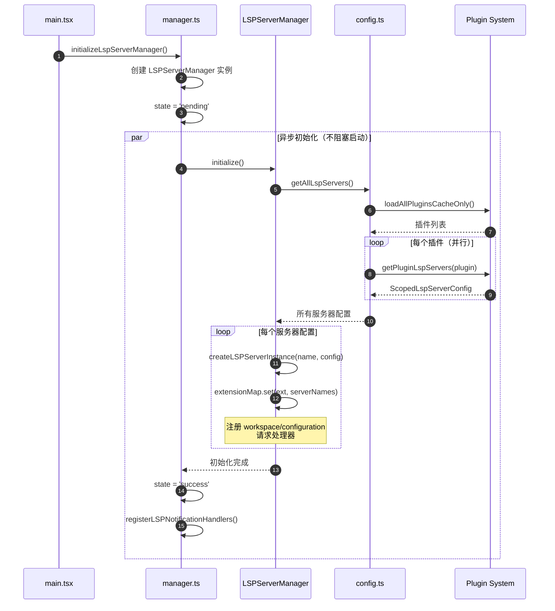
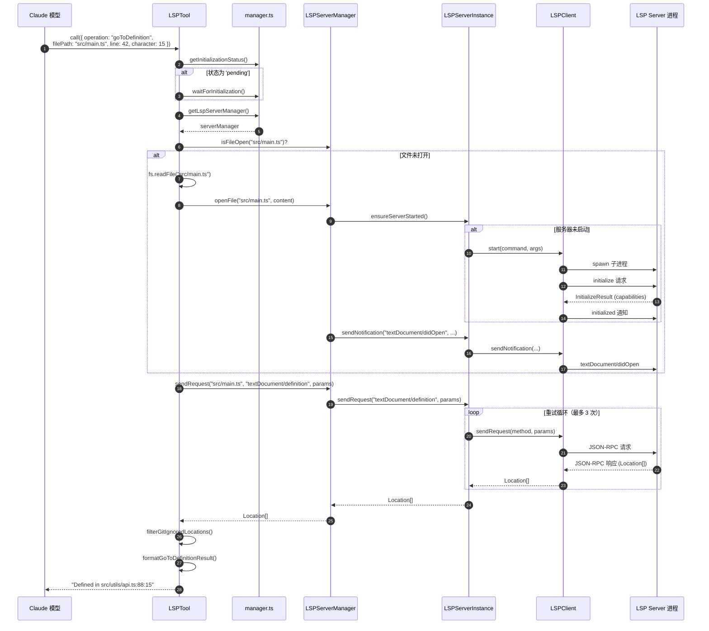

# Claude Code LSP (Language Server Protocol) 系统深度分析

> **文档类型**: 架构与实现深度解析
> **目标读者**: 核心开发工程师 / 架构研究者
> **生成时间**: 2026-04-15
> **分析范围**: LSP 子系统全部源代码（工具层、服务层、插件集成层）

---

## 执行摘要

Claude Code 内置了一套完整的 **LSP 客户端系统**，使其具备 IDE 级别的代码理解能力。这不是一个简单的文本分析工具——它是一个真正的 LSP 客户端实现，能够启动和管理多个语言服务器进程，通过 JSON-RPC 协议进行通信，并将代码智能（定义跳转、引用查找、类型悬停、调用层次等）直接暴露给 Claude 模型作为工具使用。

**核心价值**：让 Claude 模型在理解代码时不再局限于文本模式匹配，而是获得与 IDE 相同的语义级代码理解能力。

---

## 目录

1. [架构总览](#1-架构总览)
2. [LSP Tool — 工具层](#2-lsp-tool--工具层)
3. [LSP Service — 服务层](#3-lsp-service--服务层)
4. [插件集成层](#4-插件集成层)
5. [诊断系统 (被动反馈)](#5-诊断系统被动反馈)
6. [完整调用流程](#6-完整调用流程)
7. [状态机与生命周期管理](#7-状态机与生命周期管理)
8. [案例示例](#8-案例示例)
9. [关键设计决策分析](#9-关键设计决策分析)
10. [核心文件索引](#10-核心文件索引)

---

## 1. 架构总览

### 1.1 三层架构

```
┌─────────────────────────────────────────────────────────────────────────────┐
│                     工具层 (Tool Layer)                                      │
│                     src/tools/LSPTool/                                       │
│                                                                             │
│  ┌──────────────────────────────────────────────────────────────────────┐   │
│  │  LSPTool.ts          — 工具定义，调用入口，结果格式化                    │   │
│  │  schemas.ts          — Zod 输入/输出 Schema (9种操作的联合类型)          │   │
│  │  prompt.ts           — 工具描述文本                                     │   │
│  │  formatters.ts       — LSP 结果格式化器 (8种)                           │   │
│  │  symbolContext.ts    — 从文件中提取光标位置的符号名                       │   │
│  │  UI.tsx              — React 组件：工具调用渲染、结果摘要展示             │   │
│  └──────────────────────────────────────────────────────────────────────┘   │
└─────────────────────────────────────────────────────────────────────────────┘
                                      ↓ 调用
┌─────────────────────────────────────────────────────────────────────────────┐
│                     服务层 (Service Layer)                                   │
│                     src/services/lsp/                                        │
│                                                                             │
│  ┌──────────────────────────────────────────────────────────────────────┐   │
│  │  manager.ts            — 全局单例管理器，初始化编排                       │   │
│  │  LSPServerManager.ts   — 多服务器管理，文件路由，文件同步                 │   │
│  │  LSPServerInstance.ts  — 单服务器实例，生命周期，重试逻辑                 │   │
│  │  LSPClient.ts          — JSON-RPC 连接，进程管理，消息收发               │   │
│  │  LSPDiagnosticRegistry.ts — 诊断注册表，去重，容量限制                   │   │
│  │  passiveFeedback.ts    — 被动诊断处理，通知处理器注册                    │   │
│  │  config.ts             — LSP 配置加载 (从插件系统)                       │   │
│  │  types.ts              — 类型定义                                       │   │
│  └──────────────────────────────────────────────────────────────────────┘   │
└─────────────────────────────────────────────────────────────────────────────┘
                                      ↑ 加载配置
┌─────────────────────────────────────────────────────────────────────────────┐
│                     插件集成层 (Plugin Integration Layer)                    │
│                     src/utils/plugins/                                       │
│                                                                             │
│  ┌──────────────────────────────────────────────────────────────────────┐   │
│  │  lspPluginIntegration.ts  — LSP 服务器配置加载、环境变量解析、作用域     │   │
│  │  schemas.ts               — LspServerConfigSchema 验证                 │   │
│  │  lspRecommendation.ts     — LSP 插件推荐逻辑                            │   │
│  └──────────────────────────────────────────────────────────────────────┘   │
└─────────────────────────────────────────────────────────────────────────────┘
```

### 1.2 数据流概览

```
Claude 模型 (LLM)
     │
     │ 工具调用: LSP({ operation: "goToDefinition", filePath, line, character })
     ↓
LSPTool.call()
     │
     ├─ waitForInitialization()        ← 等待 LSP 系统就绪
     ├─ getLspServerManager()          ← 获取全局管理器
     ├─ manager.openFile()             ← 同步文件到 LSP 服务器
     ├─ manager.sendRequest()          ← 发送 LSP 请求
     ├─ formatResult()                 ← 格式化结果
     └─ filterGitIgnoredLocations()    ← 过滤 gitignore 文件
     │
     ↓
LSPServerManager.sendRequest()
     │
     ├─ getServerForFile()             ← 按文件扩展名路由到服务器
     ├─ ensureServerStarted()          ← 懒启动服务器
     └─ server.sendRequest()           ← 转发请求
     │
     ↓
LSPServerInstance.sendRequest()
     │
     ├─ isHealthy() 检查               ← 健康检查
     ├─ 重试循环 (ContentModified)     ← 指数退避重试
     └─ client.sendRequest()           ← JSON-RPC 请求
     │
     ↓
LSPClient (vscode-jsonrpc)
     │
     ├─ MessageConnection              ← JSON-RPC 消息连接
     ├─ child_process.stdin/stdout     ← stdio 管道通信
     └─ LSP Server 进程               ← 实际的语言服务器
```

---

## 2. LSP Tool — 工具层

### 2.1 支持的 9 种操作

**位置**: `src/tools/LSPTool/schemas.ts`

```typescript
// 使用 Zod discriminated union 实现类型安全的操作分发
z.discriminatedUnion('operation', [
  goToDefinitionSchema,       // 跳转到定义
  findReferencesSchema,       // 查找所有引用
  hoverSchema,                // 悬停信息（类型、文档）
  documentSymbolSchema,       // 文档符号列表
  workspaceSymbolSchema,      // 工作区符号搜索
  goToImplementationSchema,   // 跳转到实现
  prepareCallHierarchySchema, // 准备调用层次
  incomingCallsSchema,        // 查找调用者（谁调用了这个函数）
  outgoingCallsSchema,        // 查找被调用者（这个函数调用了谁）
])
```

每个操作共享统一的三参数输入：

| 参数 | 类型 | 说明 |
|------|------|------|
| `operation` | `enum` | LSP 操作类型 |
| `filePath` | `string` | 文件路径（绝对或相对） |
| `line` | `number` | 行号（1-based，与编辑器一致） |
| `character` | `number` | 字符偏移（1-based） |

### 2.2 操作到 LSP 方法的映射

**位置**: `src/tools/LSPTool/LSPTool.ts` — `getMethodAndParams()`

```typescript
function getMethodAndParams(input, absolutePath): { method: string; params: unknown } {
  const uri = pathToFileURL(absolutePath).href
  // 从 1-based（用户友好）转换为 0-based（LSP 协议要求）
  const position = { line: input.line - 1, character: input.character - 1 }

  switch (input.operation) {
    case 'goToDefinition':
      return { method: 'textDocument/definition', params: { textDocument: { uri }, position } }
    case 'findReferences':
      return { method: 'textDocument/references', params: { textDocument: { uri }, position, context: { includeDeclaration: true } } }
    case 'hover':
      return { method: 'textDocument/hover', params: { textDocument: { uri }, position } }
    case 'documentSymbol':
      return { method: 'textDocument/documentSymbol', params: { textDocument: { uri } } }
    case 'workspaceSymbol':
      return { method: 'workspace/symbol', params: { query: '' } }
    case 'goToImplementation':
      return { method: 'textDocument/implementation', params: { textDocument: { uri }, position } }
    case 'prepareCallHierarchy':
      return { method: 'textDocument/prepareCallHierarchy', params: { textDocument: { uri }, position } }
    case 'incomingCalls':
      // 第一步：先准备调用层次项
      return { method: 'textDocument/prepareCallHierarchy', params: { textDocument: { uri }, position } }
    case 'outgoingCalls':
      return { method: 'textDocument/prepareCallHierarchy', params: { textDocument: { uri }, position } }
  }
}
```

> **关键细节**：`incomingCalls` 和 `outgoingCalls` 是两步操作——先通过 `prepareCallHierarchy` 获取 `CallHierarchyItem`，再用该 item 请求 `callHierarchy/incomingCalls` 或 `callHierarchy/outgoingCalls`。

### 2.3 工具属性

```typescript
export const LSPTool = buildTool({
  name: 'LSP',
  searchHint: 'code intelligence (definitions, references, symbols, hover)',
  isLsp: true,                    // 标记为 LSP 工具
  shouldDefer: true,              // 延迟加载（按需启动服务器）
  isConcurrencySafe: true,        // 可并发执行（只读操作）
  isReadOnly: true,               // 只读工具
  maxResultSizeChars: 100_000,    // 最大结果字符数

  isEnabled() {
    return isLspConnected()       // 至少一个 LSP 服务器已连接时才启用
  },
})
```

### 2.4 结果格式化器

**位置**: `src/tools/LSPTool/formatters.ts`

8 个专用格式化器将 LSP 协议的原始 JSON 结果转换为人类可读（和模型可理解）的文本：

| 格式化器 | 输入类型 | 输出示例 |
|---------|---------|---------|
| `formatGoToDefinitionResult` | `Location \| LocationLink` | `Defined in src/utils/api.ts:42:15` |
| `formatFindReferencesResult` | `Location[]` | `Found 5 references across 3 files:` |
| `formatHoverResult` | `Hover` | `Hover info at 42:15:\n\nstring \| null` |
| `formatDocumentSymbolResult` | `DocumentSymbol[] \| SymbolInformation[]` | `MyClass (Class) - Line 10` |
| `formatWorkspaceSymbolResult` | `SymbolInformation[]` | `Found 12 symbols in workspace:` |
| `formatPrepareCallHierarchyResult` | `CallHierarchyItem[]` | `Call hierarchy item: myFunc (Function)` |
| `formatIncomingCallsResult` | `CallHierarchyIncomingCall[]` | `Found 3 incoming calls:` |
| `formatOutgoingCallsResult` | `CallHierarchyOutgoingCall[]` | `Found 2 outgoing calls:` |

**格式化器设计特点**：
- **文件分组**：引用和符号按文件分组显示，减少视觉噪音
- **相对路径**：URI 自动转换为相对于 CWD 的路径
- **跨平台**：正确处理 Windows `file:///C:/` 路径
- **防御性编码**：对 `undefined` URI、损坏的 JSON 等情况进行优雅降级

### 2.5 符号上下文提取

**位置**: `src/tools/LSPTool/symbolContext.ts`

在 UI 显示工具调用时，需要知道光标位置的"符号名"。`getSymbolAtPosition()` 从文件中读取对应行，用正则提取符号：

```typescript
// 支持多种语言的符号模式
const symbolPattern = /[\w$'!]+|[+\-*/%&|^~<>=]+/g
```

覆盖范围：
- 标准标识符：`myFunction`、`$variable`
- Rust 生命周期：`'a`、`'static`
- Rust 宏：`macro_name!`
- 运算符：`+`、`-`、`*`

> **性能优化**：只读取文件前 64KB，避免为获取一个符号读取整个大文件。

### 2.6 Gitignore 过滤

**位置**: `src/tools/LSPTool/LSPTool.ts` — `filterGitIgnoredLocations()`

对于 `findReferences`、`goToDefinition`、`goToImplementation`、`workspaceSymbol` 操作，结果会自动过滤掉 `.gitignore` 中的文件：

```typescript
// 批量检查路径（每批 50 个），避免命令行过长
const BATCH_SIZE = 50
for (let i = 0; i < uniquePaths.length; i += BATCH_SIZE) {
  const batch = uniquePaths.slice(i, i + BATCH_SIZE)
  const result = await execFileNoThrowWithCwd('git', ['check-ignore', ...batch], { cwd })
  // ... 过滤掉被 gitignore 的文件
}
```

---

## 3. LSP Service — 服务层

### 3.1 LSPClient — 最底层的通信原语

**位置**: `src/services/lsp/LSPClient.ts`

这是整个 LSP 系统的最底层，负责与 LSP 服务器进程的原始通信。

**核心架构**：使用 `vscode-jsonrpc` 库通过 **stdio 管道** 与子进程通信。

```
Claude Code 进程
    │
    ├─ process.stdin ──────→ LSP Server 进程 (stdin)
    │                       (JSON-RPC 请求/通知)
    │
    └─ process.stdout ←──── LSP Server 进程 (stdout)
                            (JSON-RPC 响应/通知)
```

**启动流程**：

```typescript
async start(command, args, options) {
  // 1. 启动 LSP 服务器子进程
  process = spawn(command, args, {
    stdio: ['pipe', 'pipe', 'pipe'],
    env: { ...subprocessEnv(), ...options?.env },
    cwd: options?.cwd,
    windowsHide: true,    // 防止 Windows 上弹出控制台窗口
  })

  // 2. 等待进程成功 spawn（关键！处理 ENOENT 等错误）
  await new Promise((resolve, reject) => {
    process.once('spawn', () => resolve())
    process.once('error', (error) => reject(error))
  })

  // 3. 创建 JSON-RPC 消息连接
  const reader = new StreamMessageReader(process.stdout)
  const writer = new StreamMessageWriter(process.stdin)
  connection = createMessageConnection(reader, writer)

  // 4. 注册错误/关闭处理器（防止未处理的 Promise 拒绝）
  connection.onError(...)
  connection.onClose(...)

  // 5. 开始监听消息
  connection.listen()

  // 6. 启用协议追踪（调试用）
  connection.trace(Trace.Verbose, ...)
}
```

**LSP 初始化握手**：

```typescript
async initialize(params: InitializeParams) {
  // 1. 发送 initialize 请求
  const result = await connection.sendRequest('initialize', params)
  capabilities = result.capabilities

  // 2. 发送 initialized 通知（LSP 协议要求的两步握手）
  await connection.sendNotification('initialized', {})

  isInitialized = true
}
```

**崩溃检测与恢复**：

```typescript
// 进程意外退出时回调
process.on('exit', (code) => {
  if (code !== 0 && code !== null && !isStopping) {
    const crashError = new Error(`LSP server ${serverName} crashed with exit code ${code}`)
    onCrash?.(crashError)   // 通知上层进行状态恢复
  }
})
```

**优雅停止**：

```typescript
async stop() {
  isStopping = true   // 标记为有意停止，避免错误日志
  try {
    // LSP 协议标准停止流程
    await connection.sendRequest('shutdown', {})     // 1. 发送 shutdown 请求
    await connection.sendNotification('exit', {})    // 2. 发送 exit 通知
  } finally {
    connection.dispose()    // 3. 销毁连接
    process.kill()          // 4. 终止进程
    // 清理所有事件监听器防止内存泄漏
  }
}
```

### 3.2 LSPServerInstance — 单服务器生命周期管理

**位置**: `src/services/lsp/LSPServerInstance.ts`

管理单个 LSP 服务器实例的完整生命周期，包含状态机、健康检查和重试逻辑。

**状态机**：

```
                  start()
  ┌─────────┐ ──────────────→ ┌──────────┐ ──── initialize() ────→ ┌─────────┐
  │ stopped │                  │ starting │                          │ running │
  └─────────┘ ←────────────── └──────────┘                          └─────────┘
                  停止/错误                     stop() │  │ crash
                                                   ↓  ↓
                                              ┌──────────┐
                                              │  error   │
                                              └──────────┘
                                                   │
                                                   │ restart()
                                                   ↓
                                              ┌──────────┐
                                              │ starting │ → ...
                                              └──────────┘
```

**状态类型**：`'stopped' | 'starting' | 'running' | 'stopping' | 'error'`

**ContentModified 自动重试**：

```typescript
// LSP 错误码 -32801 表示 "内容已修改"（如 rust-analyzer 正在索引）
const LSP_ERROR_CONTENT_MODIFIED = -32801
const MAX_RETRIES = 3
const RETRY_BASE_DELAY_MS = 500  // 实际延迟: 500ms → 1000ms → 2000ms

for (let attempt = 0; attempt <= MAX_RETRIES; attempt++) {
  try {
    return await client.sendRequest(method, params)
  } catch (error) {
    if (error.code === LSP_ERROR_CONTENT_MODIFIED && attempt < MAX_RETRIES) {
      await sleep(RETRY_BASE_DELAY_MS * Math.pow(2, attempt))  // 指数退避
      continue
    }
    break
  }
}
```

**崩溃恢复限制**：

```typescript
const maxRestarts = config.maxRestarts ?? 3
if (state === 'error' && crashRecoveryCount > maxRestarts) {
  throw new Error(`LSP server '${name}' exceeded max crash recovery attempts (${maxRestarts})`)
}
```

**初始化参数**（声明客户端能力）：

```typescript
const initParams: InitializeParams = {
  processId: process.pid,
  initializationOptions: config.initializationOptions ?? {},
  workspaceFolders: [{ uri: workspaceUri, name: path.basename(workspaceFolder) }],
  rootPath: workspaceFolder,     // 已弃用但某些服务器仍需要
  rootUri: workspaceUri,         // 已弃用但 typescript-language-server 需要
  capabilities: {
    workspace: {
      configuration: false,       // 不支持 workspace/configuration
      workspaceFolders: false,    // 不支持工作区文件夹变更
    },
    textDocument: {
      synchronization: { didSave: true },
      publishDiagnostics: {
        relatedInformation: true,
        tagSupport: { valueSet: [1, 2] },   // Unnecessary, Deprecated
        codeDescriptionSupport: true,
      },
      hover: { contentFormat: ['markdown', 'plaintext'] },
      definition: { linkSupport: true },
      documentSymbol: { hierarchicalDocumentSymbolSupport: true },
      callHierarchy: { dynamicRegistration: false },
    },
    general: { positionEncodings: ['utf-16'] },
  },
}
```

**延迟加载 (Lazy Require)**：

```typescript
// 延迟加载 vscode-jsonrpc (~129KB)，只在实际启动 LSP 服务器时才加载
const { createLSPClient } = require('./LSPClient.js')
```

### 3.3 LSPServerManager — 多服务器路由与管理

**位置**: `src/services/lsp/LSPServerManager.ts`

管理多个 LSP 服务器实例，根据文件扩展名自动路由请求。

**核心数据结构**：

```typescript
const servers: Map<string, LSPServerInstance> = new Map()       // 服务器实例
const extensionMap: Map<string, string[]> = new Map()           // 扩展名 → 服务器名
const openedFiles: Map<string, string> = new Map()              // URI → 服务器名（已打开文件追踪）
```

**扩展名路由**：

```
extensionMap 示例:
  ".ts"  → ["plugin:typescript:ts-server"]
  ".tsx" → ["plugin:typescript:ts-server"]
  ".py"  → ["plugin:python:pyright"]
  ".rs"  → ["plugin:rust:rust-analyzer"]
```

**文件同步协议**（LSP 规范要求）：

```typescript
// 打开文件（发送 textDocument/didOpen）
async openFile(filePath, content) {
  await server.sendNotification('textDocument/didOpen', {
    textDocument: { uri: fileUri, languageId, version: 1, text: content }
  })
}

// 修改文件（发送 textDocument/didChange）
async changeFile(filePath, content) {
  // 如果文件尚未打开，先打开
  if (openedFiles.get(fileUri) !== server.name) {
    return openFile(filePath, content)
  }
  await server.sendNotification('textDocument/didChange', {
    textDocument: { uri: fileUri, version: 1 },
    contentChanges: [{ text: content }],
  })
}

// 保存文件（发送 textDocument/didSave）
async saveFile(filePath) { ... }

// 关闭文件（发送 textDocument/didClose）
async closeFile(filePath) { ... }
```

**懒启动**：

```typescript
async ensureServerStarted(filePath) {
  const server = getServerForFile(filePath)
  if (!server) return undefined

  // 仅在需要时启动服务器（不是启动时一次性启动所有）
  if (server.state === 'stopped' || server.state === 'error') {
    await server.start()
  }
  return server
}
```

### 3.4 全局管理器 (Manager Singleton)

**位置**: `src/services/lsp/manager.ts`

全局单例，协调 LSP 系统的初始化、状态管理和关闭。

**初始化状态**：`'not-started' | 'pending' | 'success' | 'failed'`

**初始化流程**（非阻塞）：

```typescript
export function initializeLspServerManager(): void {
  // --bare 模式跳过 LSP
  if (isBareMode()) return

  // 创建管理器实例
  lspManagerInstance = createLSPServerManager()
  initializationState = 'pending'

  // 异步初始化（不阻塞启动）
  initializationPromise = lspManagerInstance
    .initialize()
    .then(() => {
      initializationState = 'success'
      // 注册被动诊断通知处理器
      registerLSPNotificationHandlers(lspManagerInstance)
    })
    .catch((error) => {
      initializationState = 'failed'
      initializationError = error
      lspManagerInstance = undefined
    })
}
```

**Generation Counter**（防止陈旧的初始化 Promise）：

```typescript
let initializationGeneration = 0

// 每次重新初始化时递增
const currentGeneration = ++initializationGeneration

// 只有当前 generation 匹配时才更新状态
if (currentGeneration === initializationGeneration) {
  initializationState = 'success'
}
```

**工具启用检查**：

```typescript
export function isLspConnected(): boolean {
  if (initializationState === 'failed') return false
  const manager = getLspServerManager()
  if (!manager) return false
  const servers = manager.getAllServers()
  for (const server of servers.values()) {
    if (server.state !== 'error') return true  // 至少有一个服务器不在 error 状态
  }
  return false
}
```

---

## 4. 插件集成层

### 4.1 LSP 配置来源

LSP 服务器**只能通过插件系统配置**，不直接支持用户/项目级设置。

**配置加载路径**：

```
插件系统
  ├── 插件目录下的 .lsp.json 文件
  ├── 插件 manifest 中的 lspServers 字段
  │     ├── 字符串路径 → 指向 JSON 文件
  │     ├── 内联配置对象
  │     └── 数组（混合以上两种）
  └── 最终合并为 Record<string, ScopedLspServerConfig>
```

### 4.2 LSP 配置 Schema

**位置**: `src/utils/plugins/schemas.ts`

```typescript
export const LspServerConfigSchema = z.strictObject({
  command: z.string().min(1),                    // LSP 服务器可执行命令
  args: z.array(nonEmptyString()).optional(),     // 命令行参数
  extensionToLanguage: z.record(                  // 文件扩展名 → 语言ID 映射
    fileExtension(), nonEmptyString()
  ),
  transport: z.enum(['stdio', 'socket']).default('stdio'),
  env: z.record(z.string(), z.string()).optional(),
  initializationOptions: z.unknown().optional(),
  settings: z.unknown().optional(),
  // ...
})
```

**配置示例**（TypeScript 语言服务器）：

```json
{
  "typescript": {
    "command": "typescript-language-server",
    "args": ["--stdio"],
    "extensionToLanguage": {
      ".ts": "typescript",
      ".tsx": "typescriptreact",
      ".js": "javascript",
      ".jsx": "javascriptreact"
    }
  }
}
```

### 4.3 环境变量解析

插件 LSP 配置支持多种变量替换：

| 变量 | 说明 |
|------|------|
| `${CLAUDE_PLUGIN_ROOT}` | 插件目录的绝对路径 |
| `${CLAUDE_PLUGIN_DATA}` | 插件数据目录 |
| `${user_config.KEY}` | 用户配置值 |
| `${ENV_VAR}` | 系统环境变量 |

### 4.4 作用域与命名空间

插件 LSP 服务器自动添加作用域前缀避免冲突：

```typescript
// 服务器名变为: "plugin:{pluginName}:{serverName}"
const scopedName = `plugin:${pluginName}:${name}`
scopedServers[scopedName] = { ...config, scope: 'dynamic', source: pluginName }
```

---

## 5. 诊断系统（被动反馈）

### 5.1 概述

除了主动的 LSP 工具调用外，Claude Code 还实现了**被动诊断收集**系统。当 LSP 服务器异步推送 `textDocument/publishDiagnostics` 通知时，这些诊断信息会被自动收集并在下一轮对话中作为**附件**注入到上下文中。

这意味着 Claude 模型**无需主动调用任何工具**就能获得实时的代码错误和警告。

### 5.2 诊断处理流水线

```
LSP Server
     │
     │ textDocument/publishDiagnostics 通知
     ↓
passiveFeedback.ts — registerLSPNotificationHandlers()
     │
     │ 格式化诊断 (severity 映射, URI 转换)
     ↓
LSPDiagnosticRegistry.ts — registerPendingLSPDiagnostic()
     │
     │ 存储 pending 诊断
     ↓
checkForLSPDiagnostics() — 在下一轮对话开始时调用
     │
     ├─ deduplicateDiagnosticFiles()  ← 去重（批内 + 跨回合）
     ├─ severity 排序                 ← 错误优先于警告
     ├─ 容量限制                      ← 每文件最多 10 条，总共最多 30 条
     └─ 交付                          ← 转换为 Attachment 注入对话
```

### 5.3 诊断去重机制

```typescript
// 两层去重:
// 1. 批内去重：同一批次的重复诊断
// 2. 跨回合去重：已交付过的诊断不再重复发送
const deliveredDiagnostics = new LRUCache<string, Set<string>>({ max: 500 })

// 诊断唯一键: message + severity + range + source + code 的 JSON 序列化
function createDiagnosticKey(diag) {
  return jsonStringify({
    message: diag.message,
    severity: diag.severity,
    range: diag.range,
    source: diag.source || null,
    code: diag.code || null,
  })
}
```

### 5.4 文件编辑后重新允许诊断

```typescript
// 当文件被编辑时，清除该文件的已交付追踪
// 允许相同的诊断再次出现（因为可能有了新的上下文）
export function clearDeliveredDiagnosticsForFile(fileUri: string): void {
  deliveredDiagnostics.delete(fileUri)
}
```

### 5.5 容量限制

| 限制 | 值 | 说明 |
|------|-----|------|
| 每文件最大诊断数 | 10 | 防止单文件大量错误淹没上下文 |
| 总诊断数上限 | 30 | 控制注入上下文的总量 |
| 已交付文件追踪上限 | 500 (LRU) | 防止长时间会话内存泄漏 |

---

## 6. 完整调用流程

### 6.1 启动阶段



### 6.2 工具调用阶段（以 goToDefinition 为例）



### 6.3 被动诊断流程

```mermaid
sequenceDiagram
    autonumber
    participant Server as LSP Server
    participant Client as LSPClient
    instance SI as LSPServerInstance
    participant PF as passiveFeedback.ts
    participant DR as LSPDiagnosticRegistry
    participant Query as query.ts
    participant Model as Claude 模型

    Note over Server: 文件被打开/修改后<br/>服务器异步分析代码

    Server-->>Client: textDocument/publishDiagnostics 通知
    Client-->>SI: onNotification handler
    SI-->>PF: 注册的处理器

    PF->>PF: formatDiagnosticsForAttachment()
    Note over PF: LSP severity → Claude severity<br/>1=Error, 2=Warning, 3=Info, 4=Hint

    PF->>DR: registerPendingLSPDiagnostic()
    Note over DR: 存储到 pendingDiagnostics Map

    Note over Query: 下一轮对话开始

    Query->>DR: checkForLSPDiagnostics()
    DR->>DR: deduplicateDiagnosticFiles()
    DR->>DR: 按 severity 排序
    DR->>DR: 容量限制 (10/文件, 30 总计)
    DR-->>Query: 诊断列表
    Query->>Query: 转换为 Attachment 注入上下文
    Query-->>Model: [上下文 + 诊断附件]
    Note over Model: 模型看到代码错误<br/>无需主动查询
```

---

## 7. 状态机与生命周期管理

### 7.1 服务器实例状态机

```
                 start() 成功
    ┌────────┐ ──────────────── → ┌─────────┐
    │ stopped │                    │ running │ ←──────────┐
    └────────┘                    └─────────┘            │
         ↑                             │                  │
         │ stop()                      │ crash / error    │ restart()
         │                             ↓                  │
         │                        ┌─────────┐             │
         │                        │  error  │ ────────────┘
         │                        └─────────┘
         │                             │
         │                             │ crashRecoveryCount > maxRestarts
         │                             ↓
         └────────────────────── [永久失败，不再重试]
```

### 7.2 全局初始化状态

```
initializeLspServerManager()
         │
         ↓
    ┌────────────┐
    │  pending   │ ← 异步初始化中
    └────────────┘
         │
    ┌────┴────┐
    ↓         ↓
┌────────┐ ┌────────┐
│success │ │ failed │ ← 初始化失败，工具不可用
└────────┘ └────────┘
    │
    │ reinitializeLspServerManager()
    ↓
  [回到 pending]
```

### 7.3 资源清理

| 场景 | 清理动作 |
|------|---------|
| 单个服务器停止 | `shutdown` 请求 → `exit` 通知 → `connection.dispose()` → `process.kill()` |
| 全局关闭 | 并行 `shutdown()` 所有运行中/错误状态的服务器 → 清空所有 Map |
| 插件重载 | `reinitializeLspServerManager()` → 关闭旧实例 → 重新加载配置 |
| 文件编辑 | `clearDeliveredDiagnosticsForFile()` → 允许诊断重新推送 |

---

## 8. 案例示例

### 案例 1：理解函数定义位置

**场景**：Claude 模型看到代码中调用了 `getAnthropicClient()`，想了解它的定义位置。

```
模型调用:
  LSP({
    operation: "goToDefinition",
    filePath: "src/services/api/claude.ts",
    line: 182,
    character: 25
  })

内部流程:
  1. 检测到 .ts 文件 → 路由到 typescript-language-server
  2. 首次使用 → 自动启动服务器
  3. 发送 textDocument/didOpen 同步文件
  4. 发送 textDocument/definition 请求

返回结果:
  "Defined in src/services/api/client.ts:88:15"
```

### 案例 2：查找所有引用

**场景**：修改一个接口定义前，需要知道哪些文件在使用它。

```
模型调用:
  LSP({
    operation: "findReferences",
    filePath: "src/types/message.ts",
    line: 15,
    character: 18
  })

返回结果:
  "Found 23 references across 8 files:

   src/services/api/claude.ts:
     Line 182:25
     Line 315:40
     Line 420:12

   src/query.ts:
     Line 45:8
     Line 112:30

   ..."
```

### 案例 3：理解调用链

**场景**：Claude 需要理解一个函数的完整调用关系——谁调用了它，它调用了谁。

```
# 第一步：准备调用层次
模型调用:
  LSP({
    operation: "incomingCalls",
    filePath: "src/query.ts",
    line: 219,
    character: 20
  })

内部流程:
  1. 先调用 textDocument/prepareCallHierarchy → 获取 CallHierarchyItem
  2. 再调用 callHierarchy/incomingCalls → 获取调用者列表

返回结果:
  "Found 5 incoming calls:

   src/QueryEngine.ts:
     query() (Method) - Line 130 [calls at: 130:15, 145:20]

   src/tools/AgentTool/AgentTool.tsx:
     runAgent() (Function) - Line 250 [calls at: 250:10]"

# 第二步：查看被调用者
模型调用:
  LSP({
    operation: "outgoingCalls",
    filePath: "src/query.ts",
    line: 219,
    character: 20
  })

返回结果:
  "Found 3 outgoing calls:

   src/services/api/claude.ts:
     queryModel() (Function) - Line 1017 [called from: 225:12]

   src/services/tools/toolOrchestration.ts:
     runTools() (Function) - Line 19 [called from: 280:8]

   src/services/compact/autoCompact.ts:
     shouldTriggerAutoCompact() (Function) - Line 340 [called from: 340:5]"
```

### 案例 4：获取类型信息

```
模型调用:
  LSP({
    operation: "hover",
    filePath: "src/services/api/client.ts",
    line: 88,
    character: 15
  })

返回结果:
  "Hover info at 88:15:

  (alias) getAnthropicClient(options: {
    apiKey?: string;
    maxRetries?: number;
    model?: string;
    fetchOverride?: FetchOverride;
    source?: string;
  }) => Promise<Anthropic>"
```

### 案例 5：被动诊断自动注入

**场景**：用户让 Claude 修改一段代码，文件保存后 LSP 服务器检测到类型错误。

```
1. Claude 修改 src/utils/api.ts 并保存
2. LSPServerManager 自动发送 textDocument/didSave 通知
3. LSP Server 异步分析文件，发送 publishDiagnostics:
   - "Type 'string' is not assignable to type 'number'" (Error, Line 42)
   - "Variable 'x' is declared but never used" (Warning, Line 38)
4. LSPDiagnosticRegistry 接收并存储诊断
5. 下一轮对话开始时，checkForLSPDiagnostics() 自动注入诊断作为附件
6. Claude 模型看到诊断信息，主动提出修复建议
```

### 案例 6：大文件保护

```
模型调用:
  LSP({ operation: "documentSymbol", filePath: "large-generated.ts", ... })

内部流程:
  1. 检查文件大小 → stats.size = 15MB
  2. 超过 10MB 限制

返回结果:
  "File too large for LSP analysis (15MB exceeds 10MB limit)"
```

---

## 9. 关键设计决策分析

### 9.1 通过插件系统配置（而非用户设置）

**决策**：LSP 服务器只能通过插件配置，不允许用户直接在 settings 中定义。

**原因**：
- LSP 服务器需要安装额外的可执行文件（如 `typescript-language-server`、`pyright`）
- 插件系统已经具备依赖管理能力
- 避免用户配置错误的 LSP 命令导致安全问题
- 插件的作用域机制 (`plugin:{name}:{server}`) 避免命名冲突

### 9.2 stdio 传输（而非 socket）

**决策**：默认使用 stdio 管道与 LSP 服务器通信。

**原因**：
- 简单可靠，无需端口管理
- 避免端口冲突
- 进程生命周期与父进程绑定
- `vscode-jsonrpc` 对 stdio 有完善支持

### 9.3 懒启动（而非启动时全部初始化）

**决策**：LSP 服务器在第一次需要处理对应文件类型时才启动。

**原因**：
- 减少启动时间和资源消耗
- 用户可能只需要其中一种语言
- `shouldDefer: true` 标记让系统知道这个工具可以延迟加载

### 9.4 全局管理器非阻塞初始化

**决策**：LSP 管理器的初始化是异步的，不阻塞 Claude Code 启动。

**原因**：
- 插件加载可能需要网络请求
- LSP 服务器启动可能很慢（如 rust-analyzer 初次索引）
- 使用 `waitForInitialization()` 在工具调用时等待就绪

### 9.5 Generation Counter 防止竞态

**决策**：使用递增的 generation counter 而非简单的 boolean 标记。

**原因**：
- 防止 `reinitializeLspServerManager()` 导致陈旧的初始化 Promise 覆盖新状态
- 在异步环境中保证状态一致性

### 9.6 vscode-jsonrpc 延迟加载

**决策**：`vscode-jsonrpc` (~129KB) 只在首次创建 LSP 服务器实例时加载。

**原因**：
- 减少启动时的模块加载开销
- 如果用户不使用 LSP 功能，就不会加载这个依赖
- 通过 `require()` 而非 `import` 实现动态加载

---

## 10. 核心文件索引

| 文件路径 | 核心职责 | 关键导出 |
|---------|---------|---------|
| **工具层** | | |
| `src/tools/LSPTool/LSPTool.ts` | LSP 工具定义，请求分发 | `LSPTool`, `Input`, `Output` |
| `src/tools/LSPTool/schemas.ts` | 输入 Schema (9种操作的联合类型) | `lspToolInputSchema`, `LSPToolInput` |
| `src/tools/LSPTool/prompt.ts` | 工具描述文本 | `LSP_TOOL_NAME`, `DESCRIPTION` |
| `src/tools/LSPTool/formatters.ts` | 8种结果格式化器 | `formatGoToDefinitionResult` 等 |
| `src/tools/LSPTool/symbolContext.ts` | 光标位置符号提取 | `getSymbolAtPosition()` |
| `src/tools/LSPTool/UI.tsx` | React UI 组件 | `renderToolUseMessage`, `LSPResultSummary` |
| **服务层** | | |
| `src/services/lsp/manager.ts` | 全局单例管理器 | `initializeLspServerManager()`, `isLspConnected()` |
| `src/services/lsp/LSPServerManager.ts` | 多服务器管理与路由 | `createLSPServerManager()` |
| `src/services/lsp/LSPServerInstance.ts` | 单服务器生命周期 | `createLSPServerInstance()` |
| `src/services/lsp/LSPClient.ts` | JSON-RPC 通信原语 | `createLSPClient()` |
| `src/services/lsp/LSPDiagnosticRegistry.ts` | 诊断注册与去重 | `registerPendingLSPDiagnostic()`, `checkForLSPDiagnostics()` |
| `src/services/lsp/passiveFeedback.ts` | 被动诊断处理 | `registerLSPNotificationHandlers()` |
| `src/services/lsp/config.ts` | 配置加载 | `getAllLspServers()` |
| **插件层** | | |
| `src/utils/plugins/lspPluginIntegration.ts` | 插件 LSP 配置加载 | `getPluginLspServers()`, `loadPluginLspServers()` |
| `src/utils/plugins/schemas.ts` | LSP 配置 Schema | `LspServerConfigSchema` |

---

## 附录 A：依赖关系图

```
vscode-jsonrpc (JSON-RPC 消息连接)
vscode-languageserver-protocol (LSP 类型定义)
vscode-languageserver-types (LSP 数据类型)
    ↓
LSPClient.ts (进程管理 + 消息收发)
    ↓
LSPServerInstance.ts (状态机 + 重试 + 生命周期)
    ↓
LSPServerManager.ts (路由 + 文件同步)
    ↓
manager.ts (全局单例 + 初始化编排)
    ↓
LSPTool.ts (工具定义 + 结果格式化)
    ↓
Claude 模型 (通过 tool_use 调用)
```

## 附录 B：LSP 协议方法速查

| Claude 操作 | LSP 方法 | 返回类型 |
|-------------|---------|---------|
| goToDefinition | `textDocument/definition` | `Location \| LocationLink \| null` |
| findReferences | `textDocument/references` | `Location[] \| null` |
| hover | `textDocument/hover` | `Hover \| null` |
| documentSymbol | `textDocument/documentSymbol` | `DocumentSymbol[] \| SymbolInformation[]` |
| workspaceSymbol | `workspace/symbol` | `SymbolInformation[]` |
| goToImplementation | `textDocument/implementation` | `Location \| LocationLink \| null` |
| prepareCallHierarchy | `textDocument/prepareCallHierarchy` | `CallHierarchyItem[]` |
| incomingCalls | `callHierarchy/incomingCalls` | `CallHierarchyIncomingCall[]` |
| outgoingCalls | `callHierarchy/outgoingCalls` | `CallHierarchyOutgoingCall[]` |
| (文件同步) | `textDocument/didOpen` | 通知（无返回） |
| (文件同步) | `textDocument/didChange` | 通知（无返回） |
| (文件同步) | `textDocument/didSave` | 通知（无返回） |
| (文件同步) | `textDocument/didClose` | 通知（无返回） |
| (被动诊断) | `textDocument/publishDiagnostics` | 服务器 → 客户端 通知 |

---

*本文档通过源代码静态分析生成，涵盖 LSP 子系统的完整架构、实现细节和交互流程。所有代码引用均来自实际源文件。*
